# Laguerre-Gaussian Mode Classifier

**Generation, simulation and neural-network classification of Laguerre-Gaussian optical modes.**

This project provides a Python library for generating and manipulating Laguerre-Gaussian (LG) beams together with neural-network models for automatic identification of LG modes from their intensity distributions.

The project combines computational optics with deep learning:

```text
              Laguerre-Gaussian modes
                       │
                       ▼
                 ┌──────────┐
                 │  lgbeam  │
                 └────┬─────┘
                      │
              beam generation
                      │
                      ▼
             simulated intensity
                      │
                      ▼
              ┌───────────────┐
              │   CNN /       │
              │   ResNet18    │
              └───────┬───────┘
                      │
                      ▼
                mode (p, l)
```

## Overview

Laguerre-Gaussian modes form a family of orthogonal solutions of the paraxial wave equation. They are commonly described using two mode indices:

* **`p`** — radial mode index,
* **`l`** — azimuthal mode index.

The spatial structure of an LG beam depends strongly on these indices, making the modes suitable for automatic recognition using image-based machine-learning methods.

This project implements both sides of the problem:

* generation and numerical manipulation of LG beams,
* automatic classification of their intensity distributions using neural networks.

---

## Gallery

### Laguerre-Gaussian modes

*A selection of generated LG modes for different values of `p` and `l`.*

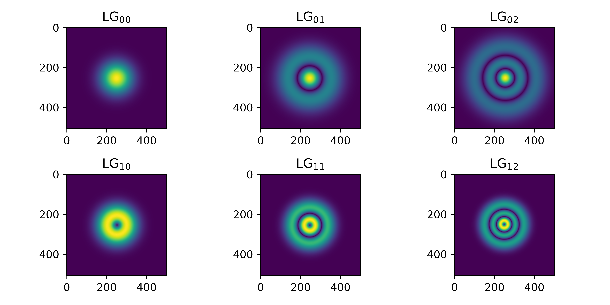

### Phase and intensity

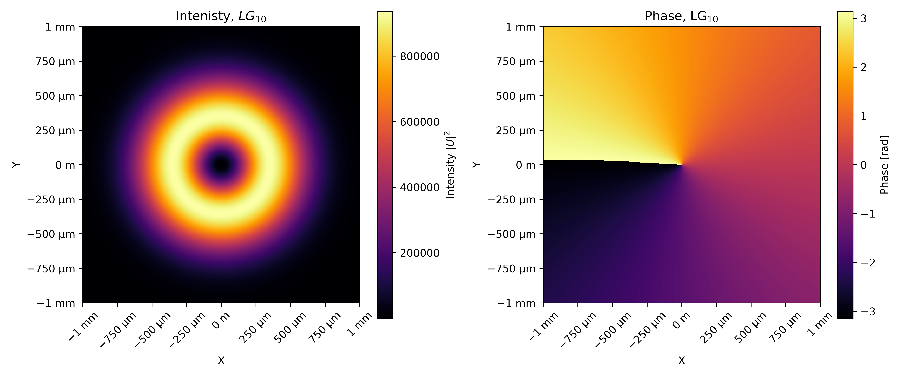

---

# `lgbeam`

`lgbeam` is the optical simulation component of the project. It provides tools for generating Laguerre-Gaussian beams and performing numerical operations on them.

The package currently targets Python 3.10+ and uses NumPy, SciPy and Matplotlib.

### Main functionality

The library supports:

* Laguerre-Gaussian mode generation,
* optical-field manipulation,
* beam propagation,
* generation of mode mixtures,
* optical vortex generation,
* visualization of simulated beams.

The repository contains example scripts demonstrating these operations.

### Basic example

```python
import lgbeam

# Create mesh
r, phi = lgbeam.mesh.create_mesh(
    L=1e-3, 
    N=512
)

# Laguerre-Gauss beam
beam = lgbeams.beams.LaguerreGauss(
    p=0, 
    l=0, 
    r=r,
    phi=phi,
    z=10e-3,
    w0=500e-6,
    wavelength=532e-9,
    n=1.0
)
```

The resulting optical field can then be used for visualization, propagation or dataset generation.

---

## Beam propagation

LG beams can be numerically propagated to investigate how their spatial structure changes along the optical axis. For that, change the axial distance from the beam's focus (waist).

<p align="center">
  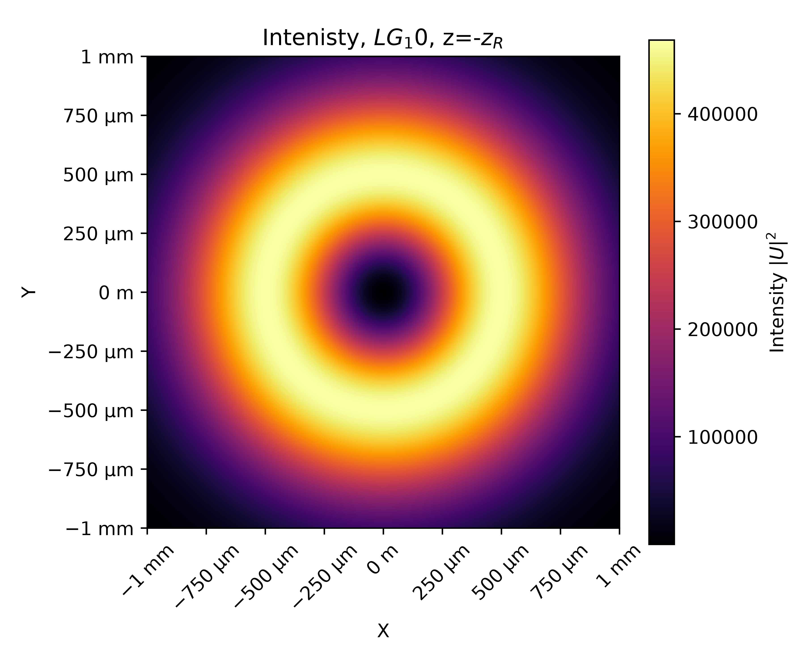
  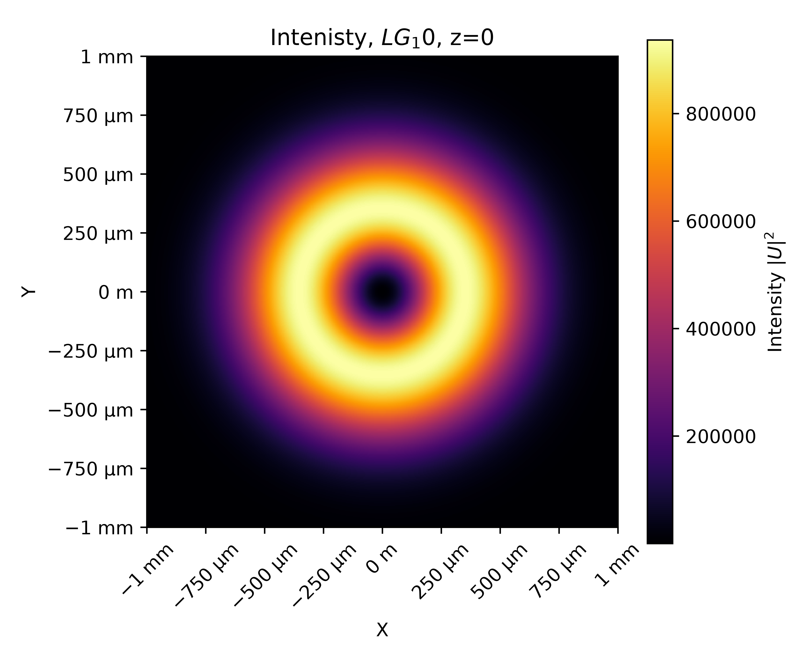
  
  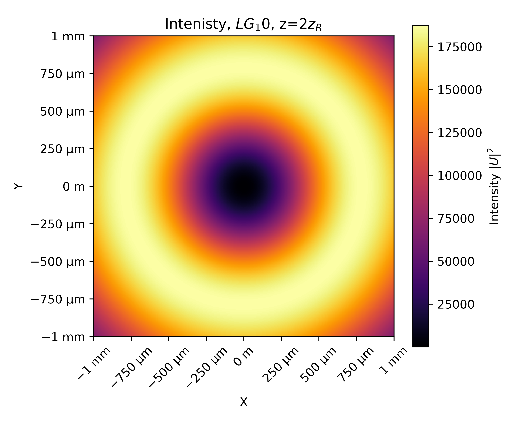
</p>

---

## Mode mixtures

The library can also be used to construct superpositions of LG modes.

<p align="center">
  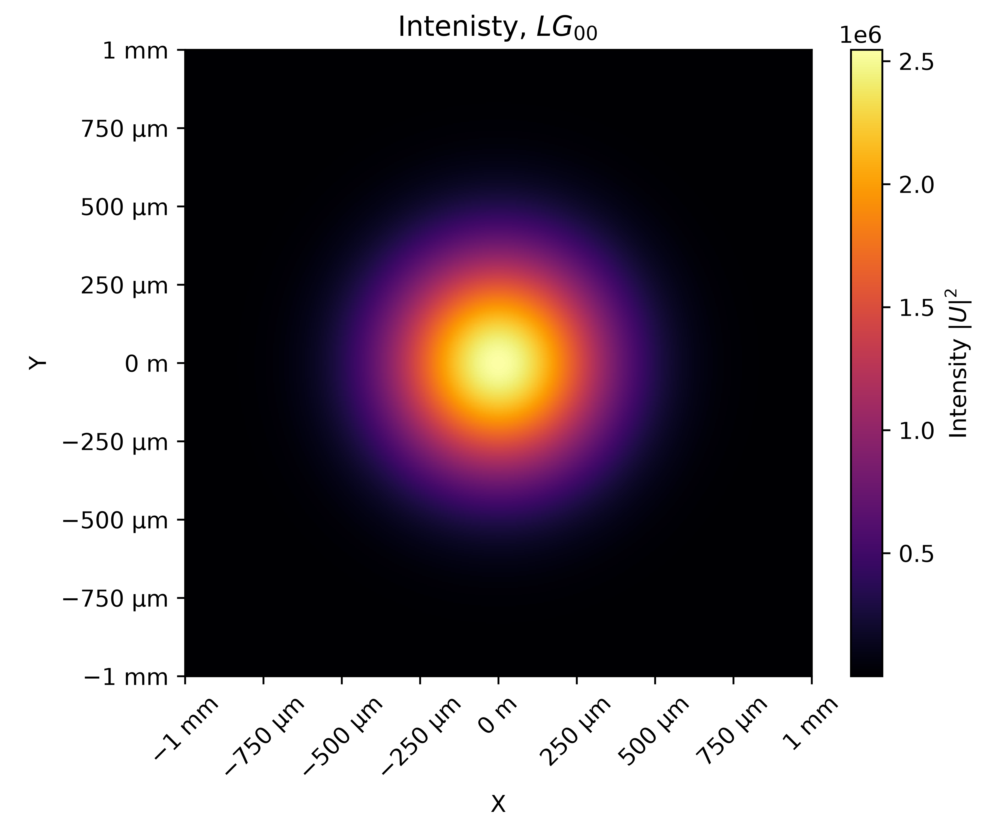
  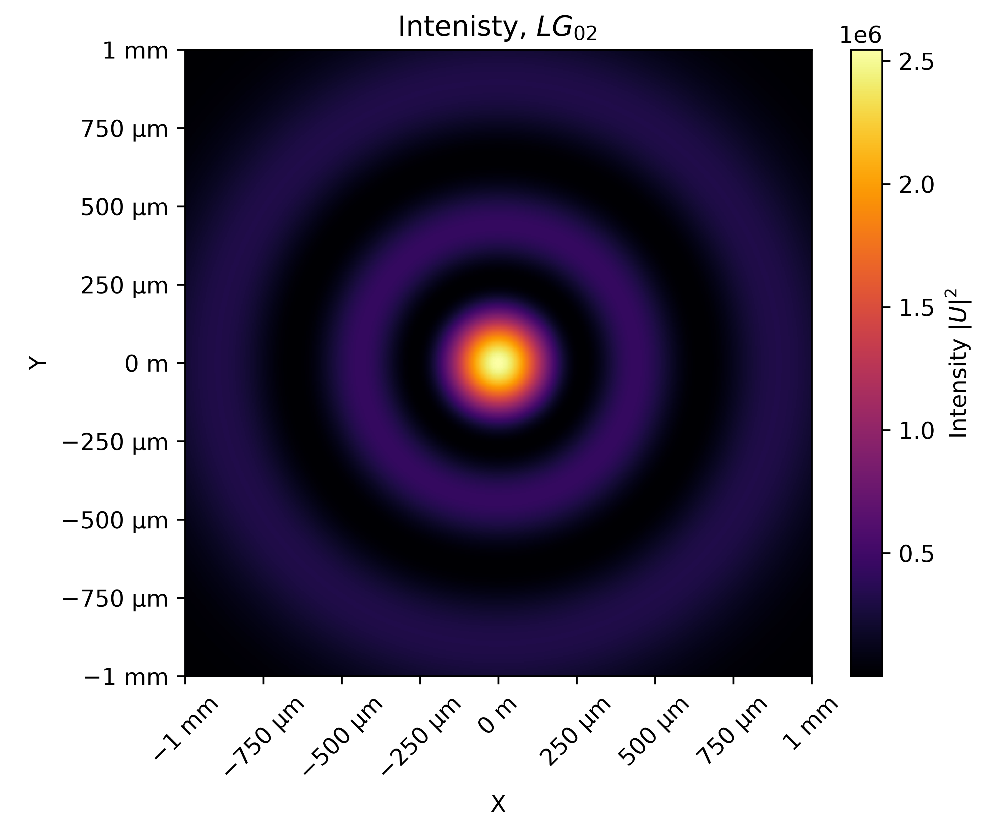
</p>

<p align="center">
  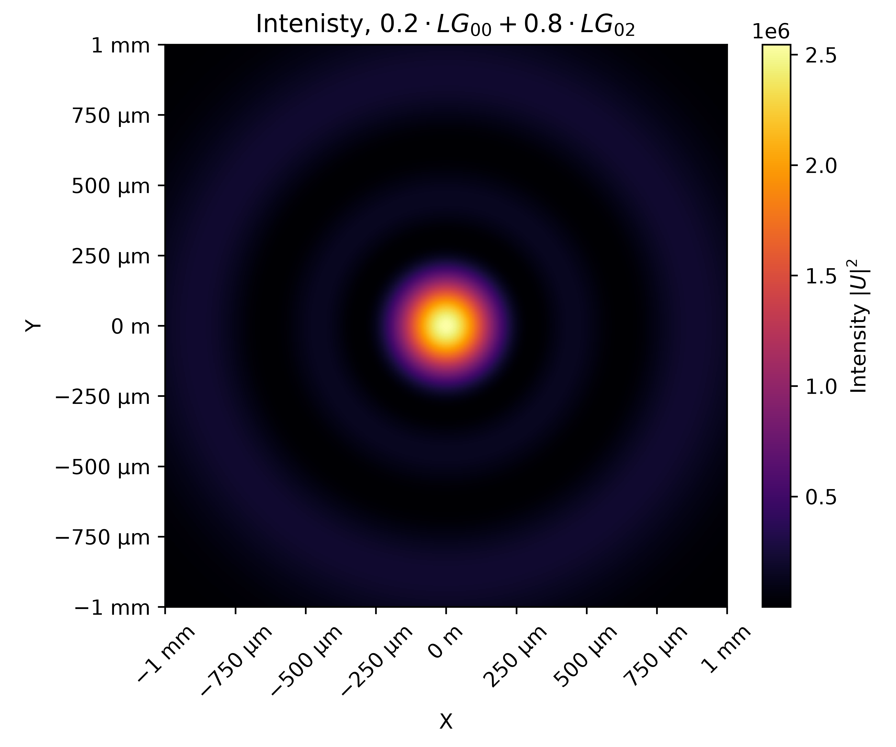
  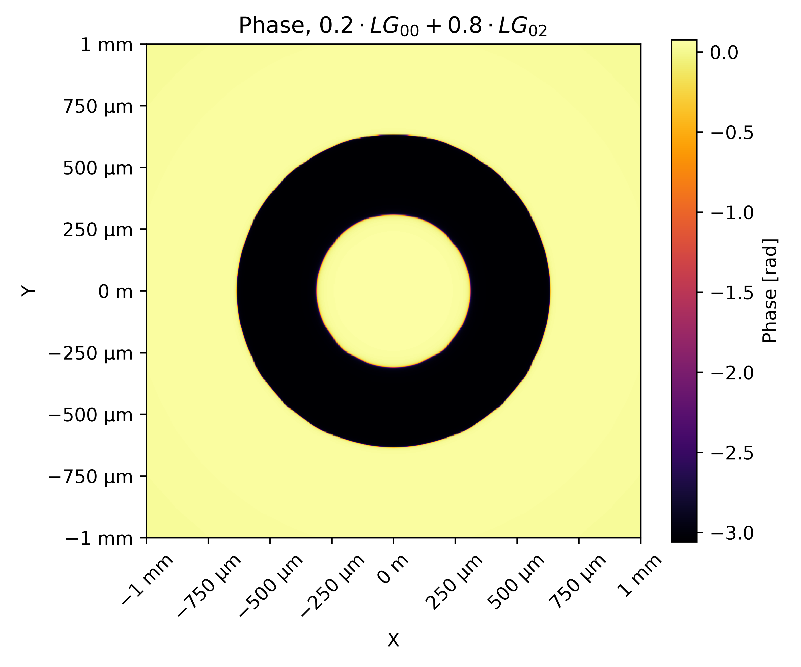
</p>
 
---

# Documentation

Documentation for the `lgbeam` package is located in:

```text
docs/lgbeam/
```

---

# Neural Network Classification

The second part of the project investigates automatic recognition of Laguerre-Gaussian modes using convolutional neural networks.

The classifier receives an image representation of an optical beam and predicts its corresponding mode indices.

```text
Laguerre-Gaussian mode
         │
         ▼
Optical field simulation (lgbeam)
         │
         ├── Generate LG mode
         ├── Propagate beam
         └── Create mode mixtures
         │
         ▼
Optical field data
         │
         ▼
   Intensity image
         │
         ▼
   Preprocessing
         │
         ▼
┌─────────────────────┐
│ Neural Network      │
│                     │
│  ┌───────────────┐  │
│  │ CNN           │  │
│  └───────────────┘  │
│          or         │
│  ┌───────────────┐  │
│  │ ResNet18      │  │
│  └───────────────┘  │
└──────────┬──────────┘
           │
           ▼
       predicted
        (p, l)
```

## Models

Two neural-network architectures are investigated:

### Convolutional Neural Network

A custom CNN is used as a compact baseline model for LG-mode classification.

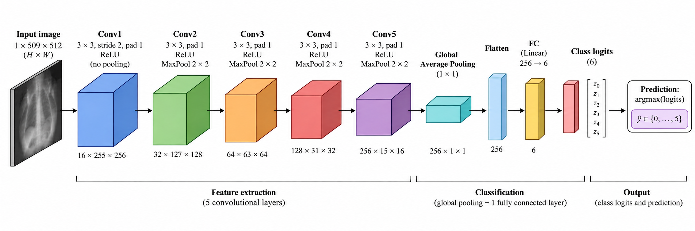


### ResNet18

A ResNet18-based architecture is used as a deeper model for comparison.

Residual connections make ResNet18 a useful reference architecture for evaluating whether a deeper network provides an advantage for this classification task. 

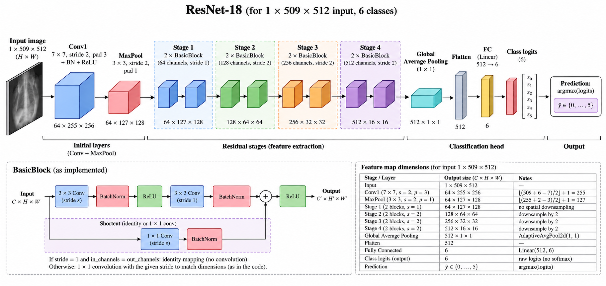

---

# Dataset Generation

One of the main advantages of the project is that the training data can be generated numerically.

Instead of relying exclusively on experimental measurements, LG modes are simulated using the `lgbeam` library and transformed into training examples.

```text
          mode indices
             (p, l)
                │
                ▼
        ┌──────────────┐
        │ LG generator │
        └──────┬───────┘
               │
               ▼
        optical field
               │
               ▼
        intensity image
               │
               ▼
        preprocessing
               │
               ▼
          training set
```

Exemplary data from the dataset

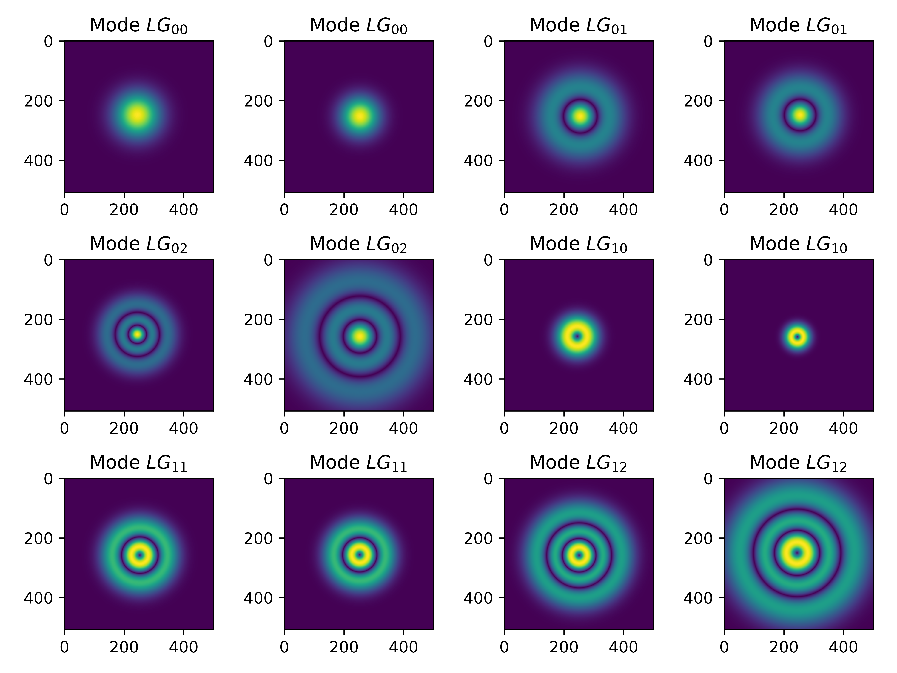


---

# Training

The neural networks are trained to map the spatial intensity distribution of a beam to its corresponding LG mode.

The classification task can be formulated as:

```text
I(x, y)  →  neural network  →  (p, l)
```

where `I(x, y)` represents the measured or simulated intensity distribution.

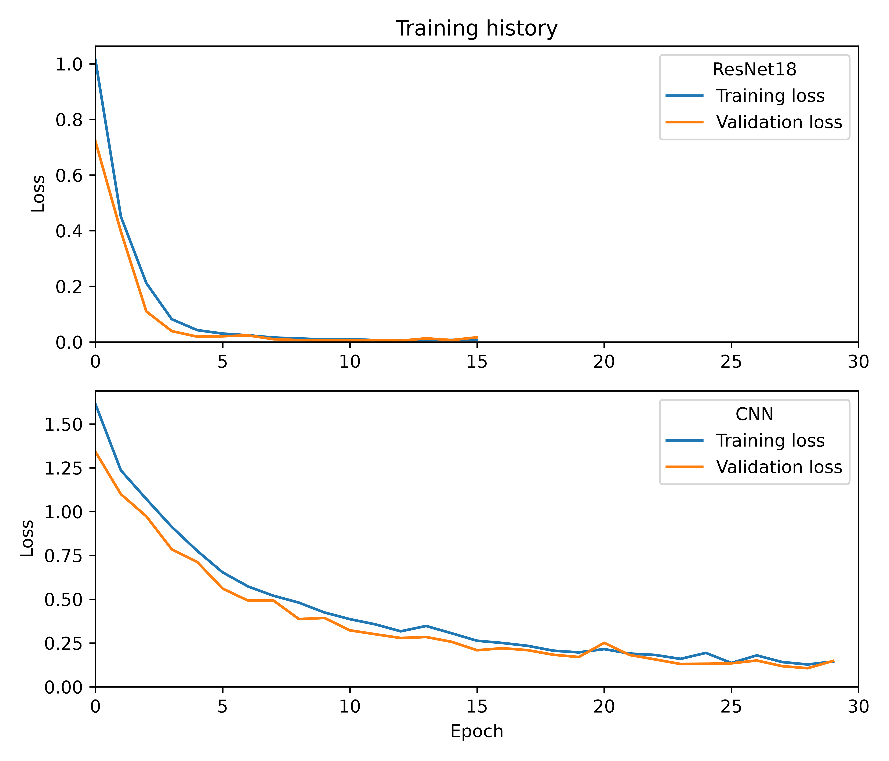

---

# Results

## Classification accuracy

If several experimental conditions were evaluated, use grouped bars or a table.

| Model    | Accuracy | Precision  | Recall    |  f1-score  | Notes                 |
| -------- | -------: | ---------: | --------: | ---------: | --------------------- | 
| CNN      |    0.967 |      0.968 |     0.967 |      0.967 | Baseline              |
| ResNet18 |      1.0 |        1.0 |       1.0 |        1.0 | Deep residual network |


---

## Confusion matrices


<p align="center">
  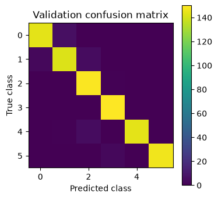
  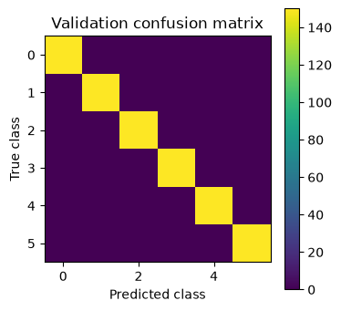
</p>

Left: CNN; Rigth: ResNet18.

The confusion matrices show which LG modes are most frequently confused by the models.

This is particularly relevant for neighboring mode indices, where intensity patterns can become increasingly similar.

---

# Installation

Clone the repository:

```bash
git clone https://github.com/mmarze/lg-mode-classifier.git
cd lg-mode-classifier
```

Install the package:

```bash
pip install -e .
```

The project currently requires Python 3.10 or newer.

---

# Usage

## Generate an LG mode

```python
import lgbeam

# Create mesh
r, phi = lgbeam.mesh.create_mesh(
    L=1e-3, 
    N=512
)

# Laguerre-Gauss beam
beam = lgbeams.beams.LaguerreGauss(
    p=0, 
    l=0, 
    r=r,
    phi=phi,
)
```

Additional examples can be found in:

```text
examples/lgbeam/
```

including examples for individual modes, mixtures, propagation and vortices.

---

# Repository Structure

```text
lg-mode-classifier/
│
├── src/
│   └── lgbeam/
│       └── ...                 # LG beam generation library
│
├── examples/
│   └── lgbeam/
│       ├── LG00.py
│       ├── LG02.py
│       ├── LG10.py
│       ├── mixture.py
│       ├── propagation.py
│       └── vortex.py
│
├── docs/
│   └── lgbeam/                 # library documentation
│
├── models/                     # trained neural-network models
├── training/                   # training code
├── tests/                      # test suite
│
├── Dockerfile
├── Dockerfile.test
├── docker-compose.yaml
├── pyproject.toml
├── LICENSE
└── README.md
```

The repository contains separate components for the optical library, examples, documentation, models, training and tests.

---

# Testing

Run the test suite with:

```bash
pytest
```

Tests are located in:

```text
tests/
```

---

# Scientific Motivation

Laguerre-Gaussian beams are important in modern optics due to their structured spatial profiles and their relation to orbital angular momentum.

Automatic identification of optical modes can be useful in areas such as:

* optical communications,
* mode multiplexing,
* optical metrology,
* beam characterization,
* computational imaging,
* structured-light systems.

This project explores how numerical optical simulations and modern image-classification methods can be combined to automate LG-mode identification.

---

# License

This project is released under the **MIT License**.

See [`LICENSE`](LICENSE) for details.

---

# Author

**Marcin Marzejon**

GitHub: [@mmarze](https://github.com/mmarze)

---

# Citation

If you use this project in academic work, please cite:

```bibtex
@software{marzejon_lg_mode_classifier,
  author = {Marzejon, Marcin},
  title = {Laguerre-Gaussian Mode Classifier},
  url = {https://github.com/mmarze/lg-mode-classifier},
  license = {MIT}
}
```

---

# Tech Stack

**Python · NumPy · SciPy · Matplotlib · PyTorch · pytest · Docker · Git**
